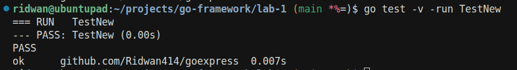
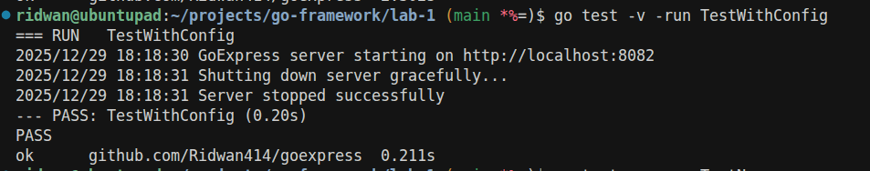
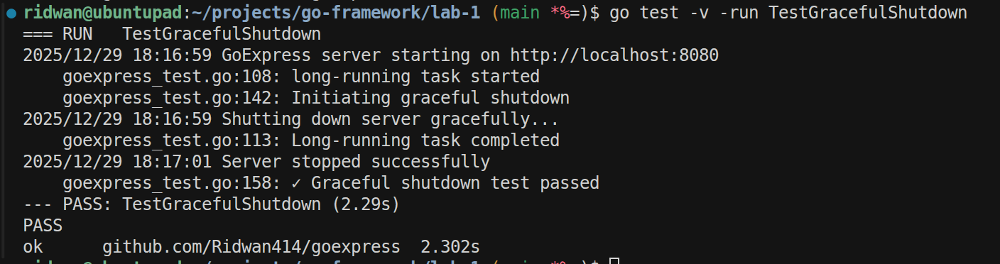

# Framework Foundation & Project Setup

## Introduction

Understanding the internal workings of the Go framework is essential to building reliable web applications. The `net/http` package is at the core of web development in Go. In this lab, we will walk through the basic workflow of a Go HTTP server, then set up our own lightweight web framework ("GoExpress") from scratch, and test our server using our engine implementation.


## Part 1: Understanding Go's net/http Package

Go provides a powerful standard library for building web infrastructure. The `net/http` package enables you to create HTTP servers and clients easily.

| Component             | Description                                                                             |
|-----------------------|-----------------------------------------------------------------------------------------|
| `http.Server`         | The HTTP server struct that manages connections, timeouts, and request handling         |
| `http.Handler`        | Interface with one method: `ServeHTTP(ResponseWriter, *Request)`                        |
| `http.ResponseWriter` | Interface for writing the HTTP response (headers, status code, body)                    |
| `http.Request`        | Struct containing all request data (method, URL, headers, body)                         |
| `ListenAndServe()`    | Starts the server and begins accepting connections                                      |


## Part 2: How the Go Web Server Handles Requests

The server uses concurrency to efficiently handle multiple connections:


**Main server loop architecture**: When the server starts, `ListenAndServe()` opens a TCP listener socket once and enters an infinite loop. The loop waits at `Accept()` until a client connects. Upon connection, it immediately spawns a dedicated goroutine with `go c.serve()` to handle that client independently, then loops back to wait for the next client, enabling multiple simultaneous connections.

Inside each goroutine:


**Per-connection request handling**: Each goroutine runs its own loop that first parses the HTTP request with `readRequest()`, then executes your `ServeHTTP()` handler containing application logic, and finally sends the response with `finishRequest()`. If HTTP keep-alive is enabled, it loops back to handle another request on the same connection; otherwise, it closes the connection and the goroutine terminates.


## Part 3: Code Walkthrough

### Download Go

If Go is not already installed, do the following:

```bash
sudo apt update
sudo apt install golang-go
```

Check your Go version:

```bash
go version
```

## Project Structure

Set up your project with this folder and file structure:

```
goexpress/
├── goexpress.go         # Main engine
├── config.go            # Configuration options
├── goexpress_test.go    # Unit tests
└── go.mod               # Go module definition
``` 

### Structure Explanation:

- **goexpress.go**: Contains the `Engine` struct, `New()`, and `Run()` methods.
- **config.go**: Configuration options for the server.
- **goexpress_test.go**: Unit tests.
- **go.mod**: Go module file.

---

### Create the Project Structure

First, create the project directory and files:

```bash
mkdir goexpress
cd goexpress
```

Initialize the Go module (replace `yourname` with your GitHub username or any identifier):

```bash
go mod init github.com/yourname/goexpress
```

Create the necessary files:

```bash
touch goexpress.go config.go goexpress_test.go
```


## Step-by-Step Solution

### Step 1: Configuration (config.go)

Define configuration options for your server:

```go
package goexpress

import "time"

// Config holds all configuration for the HTTP server
type Config struct {
    // Port is the address and port to listen on (e.g., ":8080")
    Port string

    // ReadTimeout is the maximum duration for reading the entire request, including the body
    ReadTimeout time.Duration

    // WriteTimeout is the maximum duration before timing out writes of the response
    WriteTimeout time.Duration
}

// DefaultConfig returns a Config with sensible default values
func DefaultConfig() *Config {
    return &Config{
        Port:         ":8080",
        ReadTimeout:  10 * time.Second,
        WriteTimeout: 10 * time.Second,
    }
}
```

- `Port`: In `:PORT` format (e.g., `:8080`).
- `ReadTimeout`: Prevents slow clients from holding the connection open.
- `WriteTimeout`: Prevents slow responses from blocking the server.
- `DefaultConfig()`: Returns recommended defaults.

---

### Step 2: Engine Struct (goexpress.go)

The `Engine` is the core of our framework:

```go
package goexpress

import (
    "context"
    "fmt"
    "log"
    "net/http"
)

type Engine struct {
    config *Config
    server *http.Server
}
```

- `config`: Stores the configuration.
- `server`: An instance of Go’s standard `http.Server`.

---

### Step 3: Constructor Functions

```go
// New creates an Engine with default configuration.
func New() *Engine {
    return NewWithConfig(DefaultConfig())
}

// NewWithConfig allows you to use custom configuration.
func NewWithConfig(config *Config) *Engine {
    engine := &Engine{
        config: config,
    }
    engine.server = &http.Server{
        Addr:         config.Port,
        Handler:      engine,          // Engine implements http.Handler
        ReadTimeout:  config.ReadTimeout,
        WriteTimeout: config.WriteTimeout,
    }
    return engine
}
```

- `New()`: Returns Engine with defaults
- `NewWithConfig()`: Allows for custom configuration
- `Handler: engine`: The Engine acts as the HTTP handler

---

### Step 4: Implementing http.Handler Interface

The essential method for handling requests:

```go
// ServeHTTP is called by the http package for each request.
func (e *Engine) ServeHTTP(w http.ResponseWriter, r *http.Request) {
    w.Header().Set("Content-Type", "text/plain")
    w.WriteHeader(http.StatusOK)
    fmt.Fprintf(w, "Hello from GoExpress!\n")
    fmt.Fprintf(w, "You requested: %s %s\n", r.Method, r.URL.Path)
}
```

- Use `w http.ResponseWriter` to write the response (headers, status, body)
- Use `r *http.Request` to read the request
- Always set headers before writing a body

---

### Step 5: Starting the Server

```go
// Run starts the HTTP server and listens for incoming requests.
func (e *Engine) Run() error {
    log.Printf("GoExpress server starting on http://localhost%s\n", e.config.Port)
    err := e.server.ListenAndServe()
    if err != nil && err != http.ErrServerClosed {
        return fmt.Errorf("server error: %w", err)
    }
    return nil
}
```

- Starts the server at the configured port.

---

### Step 6: Graceful Shutdown

Graceful shutdown:
  1. Stops accepting new connections
  2. Waits for ongoing requests to finish
  3. Closes all connections cleanly

```go
// Shutdown gracefully stops the HTTP server with a provided context for timeout.
func (e *Engine) Shutdown(ctx context.Context) error {
    log.Println("Shutting down server gracefully...")
    err := e.server.Shutdown(ctx)
    if err != nil {
        return fmt.Errorf("shutdown error: %w", err)
    }
    log.Println("Server stopped successfully")
    return nil
}
```

- `context.Context`: Lets you set a shutdown timeout


## Part 4: Writing Unit Tests for Server Lifecycle

Create `goexpress_test.go` to test the engine's lifecycle. We'll walk through three key tests that ensure everything works correctly:

### Test 1: TestNew - Checking Default Configuration

This test is like a quality control check for your engine's factory settings. When you create a new engine without specifying any configuration, you want to make sure it comes with sensible defaults ready to go.

```go
func TestNew(t *testing.T) {
	engine := New()

	if engine == nil {
		t.Fatal("New() returned nil, expected an Engine")
	}
	if engine.config == nil {
		t.Fatal("Engine config is nil, expected default config")
	}
	if engine.config.Port != ":8080" {
		t.Errorf("Expected default port :8080, got %s", engine.config.Port)
	}

	expectedTimeout := 10 * time.Second
	if engine.config.ReadTimeout != expectedTimeout {
		t.Errorf("Expected ReadTimeout %v, got %v", expectedTimeout, engine.config.ReadTimeout)
	}
	if engine.config.WriteTimeout != expectedTimeout {
		t.Errorf("Expected WriteTimeout %v, got %v", expectedTimeout, engine.config.WriteTimeout)
	}
	if engine.server == nil {
		t.Fatal("Engine server is nil, expected http.Server")
	}
}
```

**What's happening here:**
- First, we call `New()` to create an engine with default settings
- We verify the engine isn't `nil` (meaning it actually got created)
- We check that the config was initialized properly
- We confirm the default port is `:8080` (the standard development port)
- We verify both timeouts are set to 10 seconds (a reasonable default to prevent hanging requests)
- Finally, we make sure the underlying HTTP server was created


**Run the test:**
```
go test -v -run TestNew
```

***Output***



---

### Test 2: TestWithConfig - Custom Configuration & Real Server Test

This test not only checks if custom configuration works, but it actually starts up a real server, makes an HTTP request to it, and then shuts it down cleanly.

```go
func TestWithConfig(t *testing.T) {
	config := &Config{
		Port:         ":8082",
		ReadTimeout:  5 * time.Second,
		WriteTimeout: 6 * time.Second,
	}
	engine := NewWithConfig(config)

	// configuration checks
    if engine == nil {
		t.Fatal("NewWithConfig() returned nil, expected an Engine")
	}
	if engine.config == nil {
		t.Fatal("Engine config is nil, expected custom config")
	}
	if engine.config.Port != ":8082" {
		t.Errorf("Expected custom port :8082, got %s", engine.config.Port)
	}
	if engine.config.ReadTimeout != 5*time.Second {
		t.Errorf("Expected custom ReadTimeout 5s, got %v", engine.config.ReadTimeout)
	}
	if engine.config.WriteTimeout != 6*time.Second {
		t.Errorf("Expected custom WriteTimeout 6s, got %v", engine.config.WriteTimeout)
	}
	if engine.server == nil {
		t.Fatal("Engine server is nil, expected http.Server")
	}

	// Start server in a goroutine
	done := make(chan struct{})
	go func() {
		if err := engine.Run(); err != nil && err != http.ErrServerClosed {
			t.Errorf("Server failed: %v", err)
		}
		close(done)
	}()

	// Give the server a moment to start
	time.Sleep(200 * time.Millisecond)

	// Make a real HTTP request (to the custom port)
	resp, err := http.Get("http://localhost:8082")
	if err != nil {
		t.Fatalf("Failed to GET from server: %v", err)
	}
	defer resp.Body.Close()

	if resp.StatusCode != http.StatusOK {
		t.Errorf("Expected status 200, got %d", resp.StatusCode)
	}

	// Shutdown with timeout
	ctx, cancel := context.WithTimeout(context.Background(), 2*time.Second)
	defer cancel()
	if err := engine.Shutdown(ctx); err != nil {
		t.Errorf("Shutdown failed: %v", err)
	}
	<-done // wait for server goroutine to finish
}
```

**What's happening here:**
1. **Custom Config**: We create a custom configuration with port `:8082` and different timeout values
2. **Verify Config**: We check that our custom values were properly stored in the engine
3. **Start the Server**: We launch the server in a goroutine. We use a `done` channel to know when the server actually stops
4. **Wait for Startup**: We pause for 200 milliseconds to let the server get ready.
5. **Make a Real Request**: We send an actual HTTP GET request to `http://localhost:8082` and verify we get a 200 OK response
6. **Graceful Shutdown**: We shut down the server with a 2-second timeout, then wait for the server goroutine to finish

This test proves that your server can actually start, respond to requests, and shut down cleanly. It's the full lifecycle!

**Run the test**
```
go test -v -run TestWithConfig
```

***Output***



---

### Test 3: TestGracefulShutdown 

Tis test verifies that your server doesn't disconnect clients in the middle of their requests. When you shut down a server, you want it to finish what it's doing first.

```go
func TestGracefulShutdown(t *testing.T) {
	engine := New()

	// Track if the long-running request completed
	requestCompleted := false

	// Override ServeHTTP to simulate a long-running task
	engine.server.Handler = http.HandlerFunc(func(w http.ResponseWriter, r *http.Request) {
		// Simulate a long-running task (2 seconds)
		t.Log("long-running task started")
		time.Sleep(2 * time.Second)
		requestCompleted = true
		w.WriteHeader(http.StatusOK)
		w.Write([]byte("Long task completed"))
		t.Log("Long-running task completed")
	})

	// Start server in a goroutine
	go func() {
		if err := engine.Run(); err != nil && err != http.ErrServerClosed {
			t.Errorf("Server failed: %v", err)
		}
	}()

	// Give the server time to start
	time.Sleep(100 * time.Millisecond)

	// Make a request in the background (it will take 2 seconds)
	requestDone := make(chan struct{})
	go func() {
		resp, err := http.Get("http://localhost:8080/long-task")
		if err != nil {
			t.Errorf("Request failed: %v", err)
		} else {
			resp.Body.Close()
		}
		close(requestDone)
	}()

	// Give the request time to start processing
	time.Sleep(100 * time.Millisecond)

	// Now initiate shutdown with a 5-second timeout
	t.Log("Initiating graceful shutdown")
	ctx, cancel := context.WithTimeout(context.Background(), 5*time.Second)
	defer cancel()

	shutdownErr := engine.Shutdown(ctx)
	if shutdownErr != nil {
		t.Errorf("Shutdown failed: %v", shutdownErr)
	}

	// Wait for the request to finish
	<-requestDone

	// Verify the long-running request was completed before shutdown
	if !requestCompleted {
		t.Error("Expected long-running request to complete during graceful shutdown")
	}
	t.Log("Graceful shutdown test passed")
}
```

**What's happening here:**
1. **Setup**: We create an engine and add a flag (`requestCompleted`) to track whether our request finishes
2. **Simulate Slow Work**: We override the `ServeHTTP` handler to sleep for 2 seconds, simulating a time-consuming task like processing a large file or querying a database
3. **Start the Server**: Launch the server in a goroutine using `engine.Run()`
4. **Wait for Server**: We wait 100ms to ensure the server has started and is listening
5. **Send a Long Request**: In another goroutine, we send a GET request to `/long-task` that will take 2 seconds to complete
6. **Initiate Shutdown**: Here's the key moment! We call `Shutdown()` with a 5-second timeout context while the request is still running
7. **Wait for Request**: We wait on the `requestDone` channel for the HTTP request goroutine to finish
8. **Verify Completion**: Finally, we check that `requestCompleted` is true, proving the long-running request finished before shutdown completed

**Why this matters:**

Imagine you're running an e-commerce site and need to restart your server for updates. Without graceful shutdown, you could cut off customers mid-checkout, causing failed transactions . With graceful shutdown, the server says "OK, no new customers, but I'll finish helping everyone who's already here." This test proves your server has graceful shutdown!

The 5-second timeout is important too—it means "wait up to 5 seconds for things to finish, but if something's really stuck, force quit anyway." This prevents one buggy request from making your server hang forever during shutdown.


**Run the test:** 
```
go test -v -run TestGracefulShutdown
```

***Output***



---


You have now built the foundation for a Go web framework, demonstrated the primary server workflow, and validated its operation with comprehensive tests. These tests ensure your engine can be created with defaults, configured with custom values, started and stopped cleanly, and handle graceful shutdowns during ongoing requests. Now you can further extend your engine with routing, middleware, and more!

